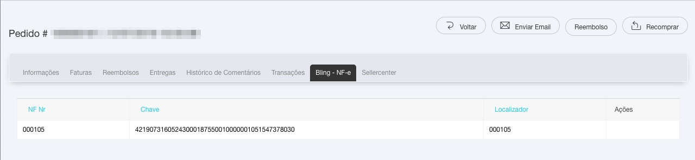

# Bling NF-e para Magento CE - élOOm
 

## Recursos

- [x] aba do Bling nos detalhes do pedido apresentando informações

- [x] acesso ao .pdf da DANFE através do link nos detalhes do pedido

#### Mapeamento dinâmico de NF-e de Saída

- [x] geração de NF-e de saída através do painel da Loja Magento

- [x] permite mapear, no painel de controle, diversos status iniciais de pedido + natureza da operação + status final de pedido

- [x] envio de pedidos em lote

- [x] mudança automática de status do pedido após gerar a NF-e no Bling


#### Mapeamento dinâmico dos métodos de frete

- [x] permite mapear, no painel de controle, diversas integrações logísticas, amarrando Método de Frete + Bling - Transportadora + Bling - Serviço de Frete

#### Mapeamento dinâmico dos métodos de pagamento

- [x] permite mapear, no painel de controle, diversas formas de pagamento, amarrando Método de Pagamento + Bling - Descrição do Pagamento

- [x] os métodos de pagamento da élOOm(MercadoPago, PagSeguro, PayU e Yapay) já estão mapeados


#### Mapeamento dinâmico de rastreamento

- [x] preenchimento do localizador no pedido por ser feito manualmente ou automaticamente com temporizador

- [x] mudança automática de status do pedido após preencher o localizador


## Perguntas Frequentes


## Dependências


O módulo do Bling ERP para Magento precisa do módulo [Bootstrap para Magento CE](https://github.com/eloom/bootstrap-magento-ce)


## Compatibilidade

- [x] Magento 1.9.3.x

- [x] PHP/PHP-FPM 5.6

## Começando

Os projetos da élOOm utilizam o [Apache Ant](https://ant.apache.org/) para publicar o projeto nos ambientes de **desenvolvimento** e de **teste** e para gerar os pacotes para o **ambiente de produção**.

- Publicando no **ambiente local**

	- no arquivo **build-desenv.properties**, informe o path do **Document Root** na propriedade "projetos.path";
	
	- na raiz deste projeto, execute, no prompt, o comando ```ant -f build-desenv.xml```.
	
	
	> a tarefa Ant irá copiar todos os arquivos do projeto no seu Magento e limpar a cache.
	

- Publicando para o **ambiente de produção**

	- na raiz deste projeto, execute, no prompt, o comando ```ant -f build-producao.xml```.
	
	
	> a tarefa Ant irá gerar um pacote no formato .zip, no caminho definido na propriedade "projetos.path", do arquivo **build-producao.properties**.

	> os arquivos .css e .js serão comprimidos automáticamente usando o [YUI Compressor](https://yui.github.io/yuicompressor/).
	

## Telas capturadas

Detalhes no pedido



Configurações Gerais


Configurações da NF-e de saída


Configurações dos métodos de frete


Configurações dos métodos de pagamento


Configurações do rastreamento


## Release Notes

### [1.0.0] - 2018-10-03

#### Versão inicial

### [1.0.1] - 2018-11-09

#### Added

- integração com Intermediador de Pagamento PayU

### [1.0.2] - 2019-07-14

#### Added

- integração com Intermediador de Pagamento Yapay